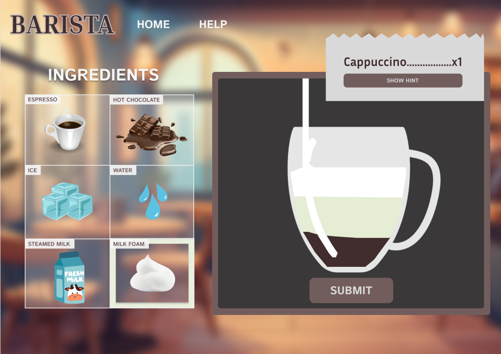
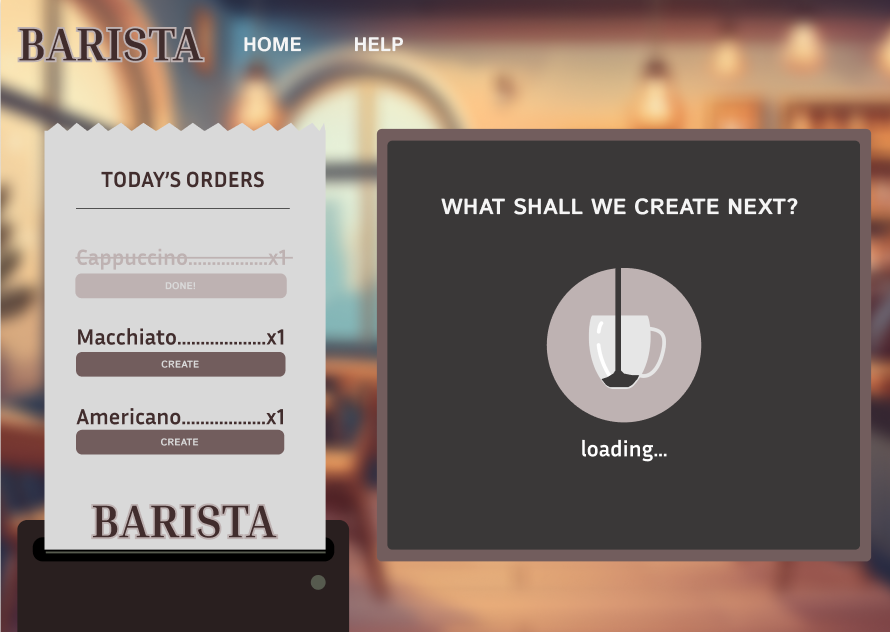
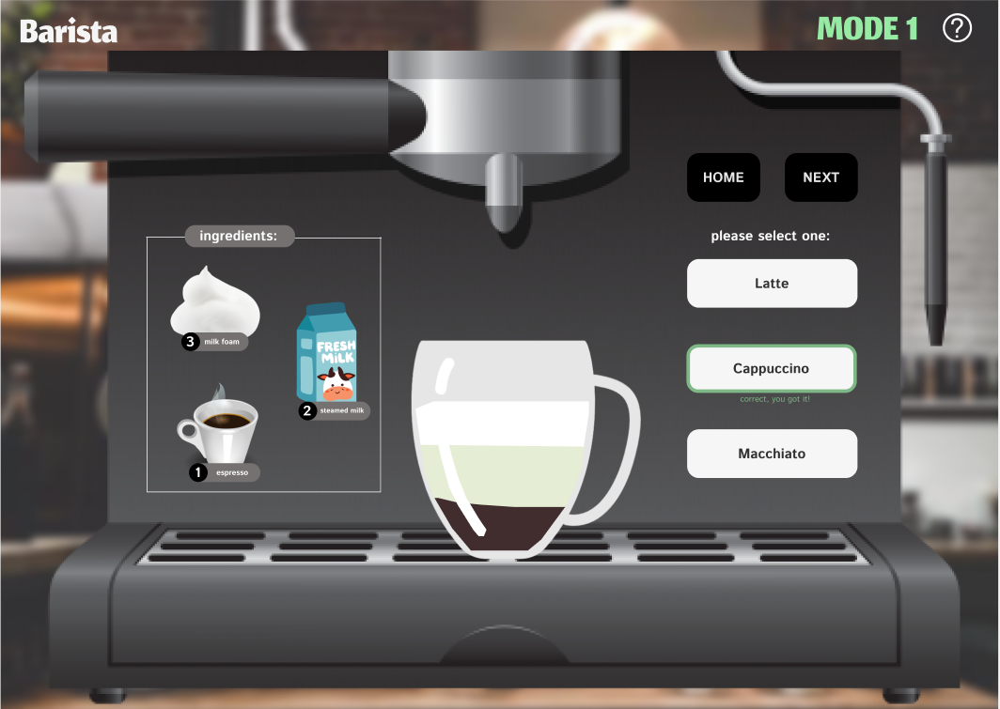
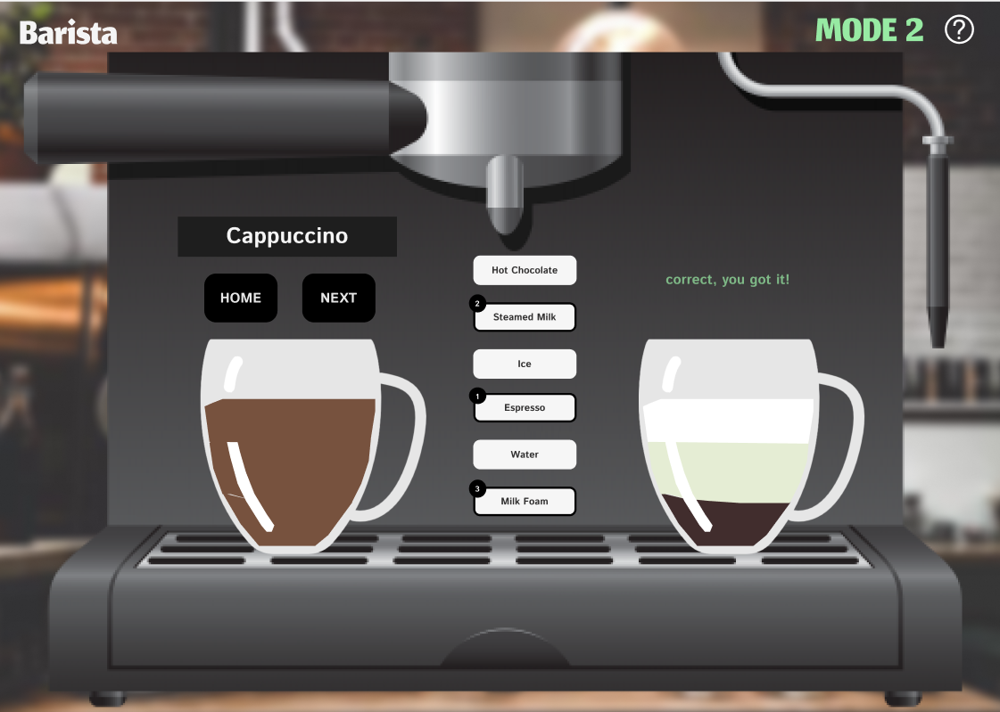
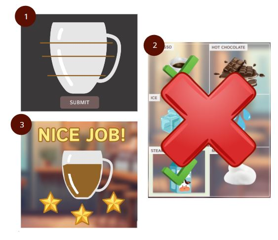
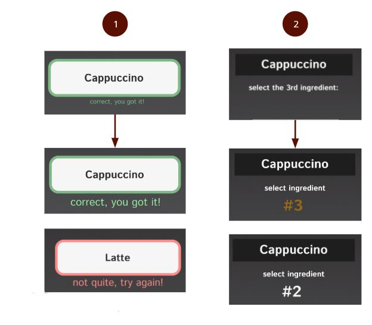
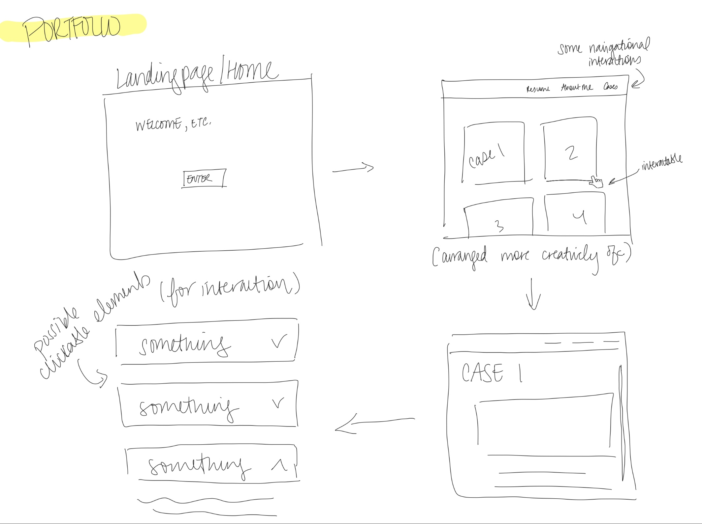
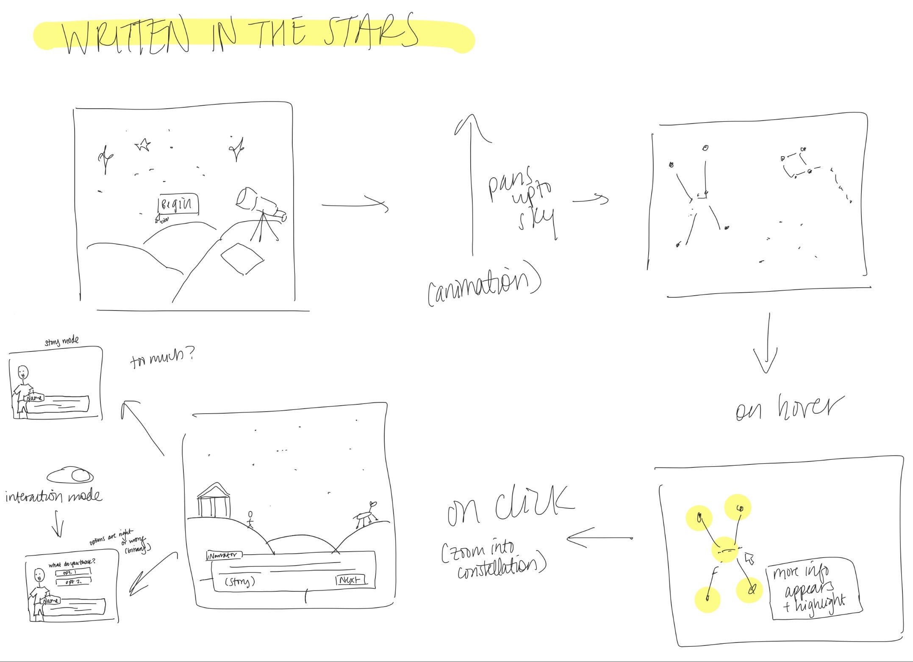
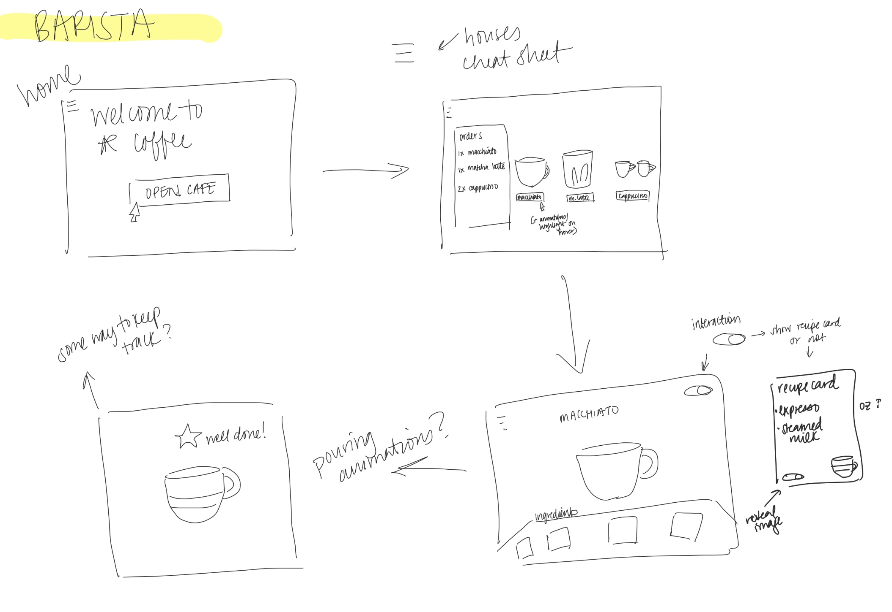

# **FP4 \- Final Project Writeup**

## Screen Sizes

Please test the interface at the following screen sizes:
* Standard: 2000 x 1550
* Smaller size: 1125 x 1350 (content becomes a column)

https://naijangh.github.io/pui-hw-njangha/final-project/title-page.html

## Accessibility Check

Title Page:
(../final-project/images/title-page-summary.jpg)
(../final-project/images/title-page-details.jpg)

Order Page:

Drink Creation Page:

Instructions Page:

## Part 1: Website Description

* My website, BARISTA, is meant to be a fun game where people can play and learn about what goes into their favorite cafe drinks. 
* The target audience is coffee lovers who enjoy cozy vibes and are considering making drinks at home more often. In future iterations, this game could also be used to train new baristas.
* The drinks I am specifically teaching people to make are Cappuccinos, Macchiatos, and Americanos.
* The game itself is engaging through a guessing format, and little animations/feedback that are meant to sustain attention.

## Part 2: User Interaction

1. Click on the "How To Play" button to learn about the game mechanics.
2. Click on the "Play" button to start the game.
3. From the list of drinks on the next page, decide on the beverage you want to recreate, and click the "Create" button.
4. From the table of ingredients, select the ones you think go into the beverage one at a time. The ingredient will turn into a green check if it is correct or a red x if it is incorrect.
5. If you need a hint, click on the "Hint" button to learn how many ingredients there are.
6. Click the "Submit" button if you think you are done. 
7. The cup will fill up and give you a rating (based on how many you guessed right/wrong) if all the ingredients are guessed.
8. If you are missing ingredients and click "Submit", you will encounter a pop-up that alerts you of missing ingredients.
9. Click the "Back" button to return to the other drink options to play again.

## Part 3: External Tool

Describe what important external tool you used (JavaScript library, Web API, animations, or other). Following the bulleted list format below, reply to each of the prompts.

1. Micron.js 
   * I chose to use this tool over the others because the implementation process made sense and it had the interactions/animations I wanted
   * I used it to make the green checks and red xs more interactive and engaging. It is also very quickly applied to the home screen buttons.
   * Micron.js adds a fun element of surprise. It also makes changes on the page more salient for users. 

## Part 4: Design Iteration

While implementing my website, I simplified (sometimes completely removed) a lot of interactions from my prototype. I cut out the beginning animation of the CLOSED/OPEN cafe sign, changed the pouring animations, and replaced the star rating system with numbers. I made these changes because they were a lot harder to implement than I expected. I felt like the video shown in class of one person having fun designing in figma and the other person fighting for their life trying to code it. I was the person fighting for my life. I made edits based on ability and time availability.

## Part 5: Implementation Challenge

I had a difficult time translating my figma prototype into css. I also faced the challenge of mimicking the animations I created in figma (especially the liquid ones).

## Part 6: Generative AI Use and Reflection

I used Adobe Stock AI to generate an image of a cafe for my website's background. I had to prompt the platform a few times to get the color palette I wanted correct. I found this to save me a lot of time. Originally, I had planned on drawing the background myself, but that was really unfeasible.

### Usage Experiences by Project Aspects

| Tool Name | Ratings | design | plan | write code | debug |
| :---- | :---- | :---- | :---- | :---- | :---- | :---- |
| Adobe Stock AI | Usage | Yes | No | No | No | No |
| Adobe Stock AI | Productivity | 7 | n/a | n/a | n/a | n/a|

### Usage Reflection

> Impact on your design and plan 
* It matched my expectations and plan in [FP2](#generative-ai-use-plan) in that I used Adobe Stock AI to find a background photo.
* It did not match my expectations and plan in [FP2](#generative-ai-use-plan) in that I did not use Microsoft Copilot or other tools for debugging or code generation. 
* GenAI tool did influence my final design and implementation plan because generating the background image saved me a lot of time since I could spend it coding instead of drawing.

> Use patterns
* I accepted the generations when the image aligned with what I was looking for. For example, 
  1. Adobe Stock AI: when they produced a cartoon image of a cafe using a brown color palette, I downloaded it.
* I critiqued/evaluated the generated suggestions by adding more detail to my prompt. For example,
  1. Adobe Stock AI: the results from me prompting a 'drawing of a cafe' were too bright. I had to edit my prompt with 'using a brown color palette' to get the results I wanted. 

> Pros and cons of using GenAI tools
* Pros
  1. Adobe Stock AI: This tool is quick and is good at making edits based on user input. It also produces unique images. 
* Cons
  1. Adobe Stock AI: This tool may not be able to replicate exactly what you envision so you may have to settle.

### Usage Log

Adobe Stock AI: I couldn't find a link to my Adobe Stock AI chat history, but I basically prompted for an 'image of a drawing of a cafe.' And then I prompted for an 'image of a drawing of a cafe with a brown color palette.' Then I selected the best result (seen in the background of my website).

---

# **FP3 \- Final Project Check-in**

Document the changes and progress of your project. How have you followed or changed your implementation & GenAI use plan and why? Remember to commit your code to save your progress.

## Implementation Plan Updates

- [- [X] Week 9 Oct 28 \- Nov 1:
  - [X] FP1 due
  
- [ ] Week 10 Nov 4 \- Nov 8:   
  - [X] FP2 due
  - [ ] confirm JS library choice
  - [ ] start to learn about how to implement a library

- [ ] Week 11 Nov 11 \- Nov 15:  
  - [X] FP3 check in
  - [X] Have skeleton HTML done
  - [X] Begin adding CSS
  - [ ] Add library to code

- [ ] Week 12 Nov 18 \- Nov 22: 
  - [X] Continue working on CSS
  - [X] Begin working on Vanilla JS
  - [ ] Start to implement library

- [ ] Week 13 Nov 25 \- Nov 29:  
  - [X] Thanksgiving  
  - [ ] Finish up JS
  - [ ] Debug

- [ ] Week 14 Dec 2 \- Dec 6:  
  - [ ] Debug
  - [ ] FP4 due

  I have a bit of catching up to do, but I ultimately feel like I am still in a good spot.

## Generative AI Use Plan Updates

- I haven't used genAI like I thought I would. I did not use Microsoft Copilor for dubugging. If I run into an error, I mainly debug my code by googling what might be wrong, using console.log(), or googling how to get the code to do what I want and examining other people's approaches. I have typically found success this way. Usually, one search gives me the keyword I need which leads to another search which leads to the solution.

I did use figma's dev tool (I am not sure if that is genAI) to help me match the css to my prototype. 

I also used Adobe Stock AI to generate a cafe image for my website's background. 

---

# **FP2 \- Evaluation of the Final project**

## Project Description

My project is a coffee shop game that teaches people how to recreate popular coffee shop drinks like cappuccinos, lattes, and macchiatos.

## High-Fi Prototypes

### *Prototype 1*

Users enjoyed the aesthetics of this game. They felt it was more intuitive than the other hifi prototype, but still was a little vague on the instructions once it was time to play the game. At this point, the 'how to play' button on the prototype does not work.

### *Prototype 2*

Users thought the multiple modes was cool but still enjoyed the first game more. Some important features felt a little too blended into the background which affected clarity in the design.

## Usability Test

Discuss the user feedback you got during the evaluation / usability test (\~300 words). Indicate which feedback you implemented, inspired new directions, or otherwise influenced your final design. 

I got a lot of feedback from the user studies. I decided to implement the following changes in my updated designs based on user feedback:

### *Prototype 1*
* When landing on the gameplay screen, P1 felt it was vague and didn’t know whether to add all the ingredients or only certain ones and if order mattered
* P1 wanted feedback for wrong selections
* P1 wasn’t sure when they were done creating the drink
* P2 expected the hint to allude to potential ingredients needed
* P2 needed more contrast on the milk foam layer (they couldn’t see a change)

### *Prototype 2*
* P1 and P2 said the separate ingredients in the cup should blend and match the other drink to show it’s done for Modes 1 and 2
* P2 said the “correct!” feedback in Mode 1 was too small
* P2 felt the “please select one” instructions should be removed once the correct choice is selected for clarity
* P2 almost missed the text change in Mode 2 because their eyes were guided to the opposite side of the screen. The change needs to be more salient

## Updated Designs

### *Prototype 1*

### *Prototype 2*

## Feedback Summary

During the lab session, my peers advised that I proceed with the first design. The second design was more confusing to navigate and the first one had helpful onboarding information. They suggested I try to solve any vagueness my users felt in the first design through progressive disclosure. They also really liked my animations and concept.

After the group critique, I plan to continue with my first design (Prototype 1). I also want to try implementing progressive disclosure and fleshing out the onboarding process to make the objectives more clear to the user.

## Milestones

### *Implementation Plan*

- [X] Week 9 Oct 28 \- Nov 1:
  - [X] FP1 due
  
- [ ] Week 10 Nov 4 \- Nov 8:   
  - [X] FP2 due
  - [ ] confirm JS library choice
  - [ ] start to learn about how to implement a library

- [ ] Week 11 Nov 11 \- Nov 15:  
  - [ ] FP3 check in
  - [ ] Have skeleton HTML done
  - [ ] Begin adding CSS
  - [ ] Add library to code

- [ ] Week 12 Nov 18 \- Nov 22: 
  - [ ] Continue working on CSS
  - [ ] Begin working on Vanilla JS
  - [ ] Start to implement library

- [ ] Week 13 Nov 25 \- Nov 29:  
  - [ ] Thanksgiving  
  - [ ] Finish up JS
  - [ ] Debug

- [ ] Week 14 Dec 2 \- Dec 6:  
  - [ ] Debug
  - [ ] FP4 due

### *Libraries and Other Components*

List the JS libraries and other components (if applicable) that you plan to use. 
* micron.js for microinteractions within my game
* Google images for different icons

If I come across any other libraries, I will come back and update accordingly.

## Generative AI Use Plan

I plan to use GenAI tools as a debugging resource. I will upload my current code and ask it to help me identify what's wrong with it. If I encounter confusing code on the internet when I am googling my error code, I will also ask GenAI to help me understand the code I find. If I get really stuck and ask it to generate code, I will also ask it to explain the code so I can understand everything I include in my code files. 

### *Tool Use*

 What would you use? Edit the list given your plan. For each tool, explain briefly on what do you expect Generative AI to help you with and what might it not be able to help you with.

* Microsoft Copilot  
  * I will use it for checking my current code because it can help me debug or understand error messages  
  * I will not use it for complex errors like logic errors because it might not be able to help me with figuring that out. It will probobaly keep generate basic debugging tips and reminders.

* Adobe Stock
  * I will use this to generate stock images for my backgrounds
   
This is all I have experience with GenAI-wise. For this project, I might explore other tools like Chat-GPT or Perplexity or Github Copilot. If I do decide to try those tools and implement them, I will come back to this document and update accordingly. 

### *Responsible Use*

I would use Generative AI responsibly by always citing when I use it in the comments in my code. I will also make sure I fully understand any generated code I choose to include. In addition to that, I will double check with the TA or professors to make sure the generated code is still following clean code practices. 

---

# **FP1 \- Proposal for Critique**

## Idea Sketches

### *Idea 1*

In this final project, I will use a library like react.js or vue.js to build my personal portfolio and showcase my projects. 

I would make my design engaging through the visuals and micro-animations/interactions. I would make it interactive by allowing visitors to navigate to different pages and delve deeper into each project through clickable elements. 

I plan to make my design accessible using semantic code to make my HTML compatible with accessibility devices like screen readers.

I want my portfolio to convey who I am as a designer (including my coding capabilities) through my CSS styling choices and featured projects.  

### *Idea 2*

In this final project, I would use a library like AstroJs to allow users to move through constellations in the sky and read about the mythology behind them.

I plan to make my design engaging through micro-interactions and storytelling. I would make the design interactive by allowing users to move around the night sky, select constellations to know more, and potentially answer binary (right or wrong) questions about what they think happens next in the myth. 

One of my questions for the critique was about making the navigation accessible. I think I would have to consider multiple methods of moving around (with a mouse, with the keyboard, gestures, etc). I would also include an undo move and return to the starting position button. 

I want to educate and entertain people about Ancient Greek mythology. I also enjoy looking at constellations and would love to convey that joy and spark interest in visitors.

### *Idea 3*

In this final project, I would use a game to teach people about the proper recipes and procedures of creating common cafe drinks like a latte, cappuccino, americano, etc.

I would make my design engaging through little animations, cute art, and through the challenge of the game. Visitors would have to interact with different ingredients and fulfill orders. They would also be judged based on how well they did (through a cafe rating at the end of a shift, for example).

I plan to make the design accessible by allowing users to tab through ingredients in addition to using a mouse to select. I do need to consider more ways to ensure this project is accessible. 

I want to teach people the proper way to build common cafe drinks. I could also see this website being used to train incoming baristas.

## Feedback Summary

Overall, the critique was very helpful. 

For the Portfolio Proposal, they mentioned it might be difficult to code an entire portfolio from scratch when I do not have many projects to begin with, within the time we have left in the semester. They also agreed with my concerns about coding in a sustainable manner where I will be able to go back and add more projects seamlessly with my tendency to rush. There was a suggestion to possibly prioritize having another piece for my portfolio given my lack. 

For the Written in the Stars Proposal, they asked about how people would navigate on the site, if I prefered an infinite canvas or a list view, if there will be a way to get back to start, or if I would include a search feature. They were intrigued by the storytelling aspect.

My Barista Proposal got the most support. They felt there was more emotional value and nostalgia. The main suggestion was to decide on an aesthetic and the type of animations I would incorporate (like 2D SVGs).

## Feedback Digestion

After the critique in the lab, I am leaning toward my Barista Proposal. I agree with the opinion that I should prioritize building the content of my portfolio before trying to build my portfolio. I also think it is the most doable project given the time constraints. I will incorporate the feedback of having more of a cozy and nostalgic aesthetic. I will have to look more into what 2D SVG animation is before deciding whether to incorporate or dismiss that critique. There was not a lot of critique around this proposal so I will probably need to flesh out the idea more and ask for more input. 