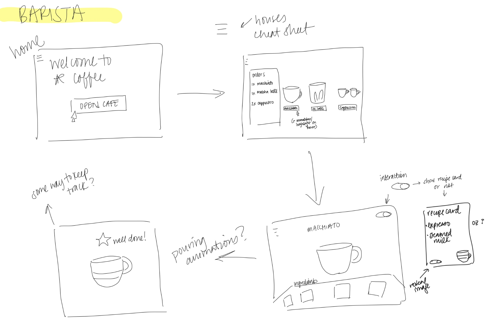

# **FP1 \- Proposal for Critique**

## Idea Sketches

### *Idea 1*

In this final project, I would use a library like react.js or vue.js to build my personal portfolio to showcase my projects. 

I would make my design engaging through the visuals and micro-animations/interactions. I would make it interactive by allowing visitors to navigate to different pages and delve deeper into each project through clickable elements. 

I plan to make my design accessible by using semantic code to make my html compatible with accessibility devices like screen readers.

I want my portfolio to convey who I am as a designer (including my coding capabilities) through my CSS styling choices and featured projects.  

### *Idea 2*

In this final project, I would use a library like AstroJs to allow users to move through constellations in the sky and read about the mythology behind them.

I plan to make my design engaging through micro-interactions and storytelling. I would make the design interactive by allowing users to move around the night sky, select constellations to know more, and potentially answer binary (right or wrong) questions about what they think happens next in the myth. 

One of my questions for the critique was about making the navigation accessible. I think I would have to consider multiple methods of moving around (with a mouse, with the keyboard, gestures, etc). I would also include an undo move and return to starting position button. 

I want to educate and entertain people about Ancient Greek mythology. I also enjoy looking at constellations and would love to convey that joy and spark interest within visitors.

### *Idea 3*

In this final project, I would use a game to teach people about the proper recipes and procedures of creating common cafe drinks like a latte, cappuccino, americano, etc.

I would make my design engaging through little animations, cute art, and through the challenge of the game. Visitors would have to interact with different ingredients and fulfill orders. They would also be judged based on how well they did (through a cafe rating at the end of a shift, for example).

I plan to make the design accessible by allowing users to tab through ingredients in addition to using a mouse to select. I do need to consider more ways to ensure this project is accessible. 

I want to teach people the proper way to build common cafe drinks. I could also see this website being used to train incoming baristas.

## Feedback Summary

Overall, the critique was very helpful. 

For the Portfolio Proposal, they mentioned it might be difficult to code an entire portfolio from scratch when I do not have my projects to begin with within the time we have left in the semester. They also agreed with my concerns about coding in a sustainable manner where I will be able to go back and add more projects seamlessly with my tendency to rush. There was a suggestion to possible prioritize having another piece for my portfolio given my lack. 

For the Written in the Stars Proposal, they asked about how people would navigate on the site, if I prefered an infinite canvas or a list view, if there will be a way to get back to start, or if I would include a search feature. They were intrigued by the storytelling aspect.

My Barista Proposal got the most support. They felt there was more emotional value and nostalgia. The main suggestion was to decide on an aesthetic and the type of animations I would incorporate (like 2D SVGs).

## Feedback Digestion

Digest the feedback you got in the lab (\~300 words). Indicate which critique you will act on in your next design and why you chose to incorporate/dismiss pieces of critique.